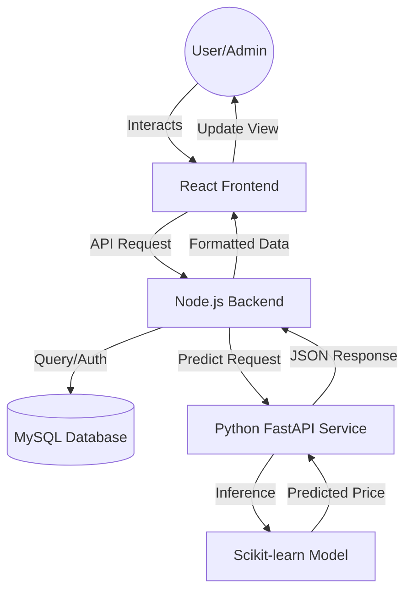

# Project Report: EstateValue
### AI-Driven Real Estate Price Prediction & Management System

---

## 🚀 1. Introduction
**EstateValue** is a modern real estate platform that combines property management with Artificial Intelligence to provide accurate market valuations. The system allows users to browse listings, while owners/admins can manage their inventory and verify if their pricing is competitive using a Machine Learning model trained on historical market data.

## ⚠️ 2. Problem Statement
Real estate pricing is often volatile and lacks transparency. Buyers frequently struggle to determine if a property is "fairly priced" or "overpriced" based on location and size. Standard platforms offer listings but rarely provide data-driven insights to help users make informed financial decisions.

## ✅ 3. Solution Overview
Our solution addresses this by:
1.  **Centralizing Listings**: A clean, responsive interface to view and manage properties.
2.  **AI Valuation**: A Machine Learning service that analyzes square footage, location, and BHK to predict the "Fair Market Value."
3.  **Real-time Insights**: Automated status badges (Fair, Overpriced, Underpriced) that appear instantly for every listing, helping users identify the best deals.

## 🛠️ 4. Tech Stack
| Tier | Technology | Rationale |
| :--- | :--- | :--- |
| **Frontend** | React 19, Tailwind 4, Framer Motion | Modern, fast, and high-quality animations for premium UX. |
| **Backend** | Node.js, Express | Highly scalable and efficient for handling API requests. |
| **Database** | MySQL | Robust relational database for property and user management. |
| **ML Service** | Python (FastAPI, Scikit-learn) | Industry standard for implementing Machine Learning models. |
| **Modeling** | Linear Regression | Simple yet effective for predicting continuous price variables. |

## 📊 5. Feature List
- **User Authentication**: Secure Login/Register with JWT tokens.
- **AI Prediction Engine**: Predict property prices based on real-world factors.
- **Admin Dashboard**: Comprehensive CRUD operations (Create, Read, Update, Delete).
- **Inventory Analytics**: Quick stats for total listings and average market price.
- **Responsive Design**: Fully functional across desktop, tablet, and mobile devices.

## 🔄 6. System Architecture (Flow)

---

## 💡 7. Demo Strategy (Key Talking Points)
1.  **AI Accuracy**: Mention that the model is trained on the "Bengaluru House Price" dataset from Kaggle, ensuring realistic results for local areas.
2.  **The "Status" Badge**: Highlight that the system doesn't just show a price—it *critiques* it. If a listed price is 15% higher than the AI prediction, it's flagged as "Overpriced."
3.  **Scalability**: Explain that the decoupled architecture (Frontend, Backend, ML separately) allows the system to handle thousands of users effortlessly.

---
**Developed for Final Year Project (2026)**
